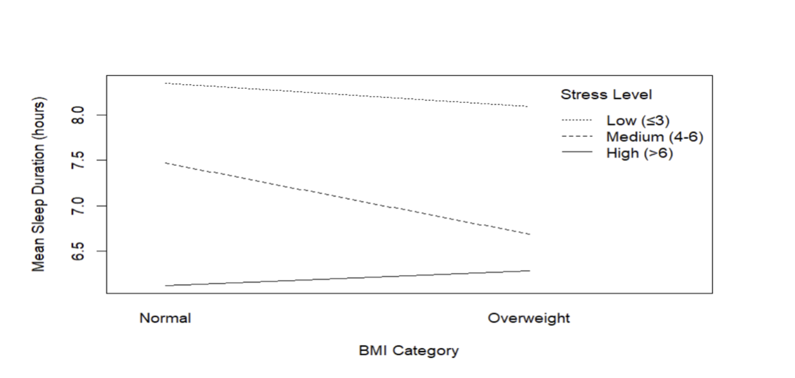
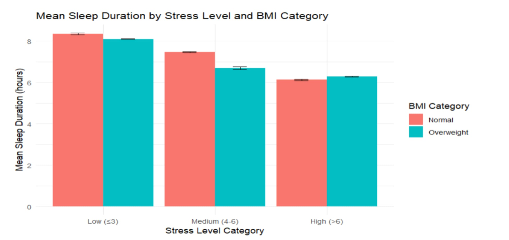

# 🛌 Sleep Duration Statistical Analysis

> Statistical analysis examining how **stress level** and **BMI category** influence sleep duration using a **Two-Way ANOVA** in **R**.


---

## 📖 Overview

This project investigates how **stress level** and **BMI category** influence sleep duration using a **Two-Way Analysis of Variance (ANOVA)**.

Completed as part of **STAT 301 – Analysis of Variance and Multivariate Analysis** at **Metropolitan State University**, our team cleaned and prepared the dataset, engineered categorical variables, performed statistical modeling, and interpreted both the main effects and interaction effects.

---

## 🎯 Research Question

**How do stress level and BMI category individually—and together—influence sleep duration?**

---

## 📊 Dataset

- **Dataset:** Sleep Health and Lifestyle Dataset
- **Observations:** 364
- **Dependent Variable:** Sleep Duration (hours)
- **Independent Variables**
  - Stress Level Category
  - BMI Category

---

## 🔬 Methodology

This analysis included:

- Data cleaning and preprocessing
- Feature engineering
- Stress level categorization
- Two-Way ANOVA using a linear model (`lm`)
- Type II ANOVA for unbalanced data
- Welch Two-Sample t-tests
- Data visualization using **ggplot2**

---

# 📈 Visualizations

## Interaction Between Stress Level and BMI Category

<p align="center">
  
</p>

The interaction plot illustrates that sleep duration decreases as stress increases for both BMI groups. The non-parallel lines indicate a statistically significant interaction, suggesting that the relationship between stress level and sleep duration differs across BMI categories.

---

## Mean Sleep Duration by Stress Level

<p align="center">
  
</p>

Mean sleep duration decreased as stress levels increased for both BMI groups. Individuals with a Normal BMI generally slept longer at low and medium stress levels, while the relationship slightly reversed at high stress levels, supporting the interaction identified by the ANOVA.

---

# 📋 Key Findings

- Stress level significantly affected sleep duration (**p < 0.001**).
- BMI category significantly affected sleep duration (**p < 0.001**).
- A significant interaction effect was found between stress level and BMI category (**p < 0.001**).
- Sleep duration consistently decreased as reported stress levels increased.
- The relationship between BMI and sleep duration changed under high stress conditions.

---

# 🛠 Skills Demonstrated

- R Programming
- Statistical Analysis
- Two-Way ANOVA
- Hypothesis Testing
- Type II ANOVA
- Welch Two-Sample t-tests
- Data Cleaning
- Feature Engineering
- Data Visualization (ggplot2)
- Statistical Interpretation
- Technical Report Writing

---

# 📂 Repository Structure

```text
sleep-duration-statistical-analysis
│
├── data/
│
├── images/
│   ├── interaction-plot.png
│   └── bar-chart.jpeg
│
├── sleep-anova-analysis.Rmd
├── Sleep_Analysis_TwoWay_ANOVA_Report.docx
└── README.md
```

---

# 👥 Authors

- Maria Larson
- Izzy Mika
- Jiaming Zhang

---

## 🎓 Course Information

**Course:** STAT 301 – Analysis of Variance and Multivariate Analysis

**Institution:** Metropolitan State University

**Project Type:** Team Statistical Analysis Project
